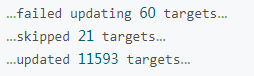
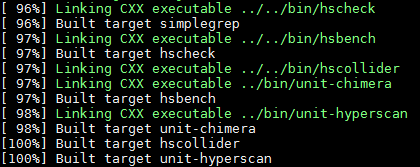
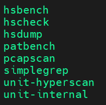
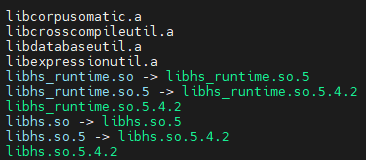

# Installation Guide

## Introduction

This document describes how to install and compile Ultrascan based on Kunpeng 920 series processors and openEuler.

Ultrascan is a high-performance regular expression matching library. It is developed based on Perl Compatible Regular Expressions (PCRE) and is open-source under the Berkeley Software Distribution (BSD) license. It follows the regular expression syntax of the libpcre library but has its own C interfaces. Based on the official Ultrascan release and Kunpeng microarchitecture, the implementation mechanism of core interfaces is redesigned, the development and performance are optimized, and the software package suitable for the Kunpeng platform is released. Users of the Kunpeng platform can download this software package based on their service requirements to improve the stability and performance of services on the Kunpeng platform.

The following functions are added to the Ultrascan version dedicated for the Kunpeng platform:

- The Kunpeng platform branch fully compatible with Armv8-A is added. In addition, its use on the x86 platform is not affected.
- NEON instructions, inline assembly, data alignment, instruction alignment, memory prefetch, static branch prediction, and code restructuring are used to improve the performance on the Kunpeng platform.
- The Kunpeng Hyperscan Enhanced Library (KHSEL) is released. It includes a hybrid model with a short-rule bypass and a false-positive blocking model.
    - KHSEL optimizes the large-pattern matching algorithm FDR, small-pattern quick matching algorithm Shufti, and long-rule verification, and enhances the scan performance of Ultrascan for processing datasets such as snort_literal and snort_pcre.
    - The hybrid model with a short-rule bypass significantly improves the matching performance for rule sets containing short rules.
    - The false-positive blocking model greatly improves the matching performance for rule sets containing bad string fragments. Bad strings refer to a small number of rules with special fragments, causing excessive false positives in multi-pattern matching. This triggers a large number of interpreter calls and inefficient long-rule verification, but yields zero true matches. These unnecessary interpreter calls become computing hotspots, undermining the pre-filtering capability of multi-pattern matching.
- The universal bytecode function is added. Users can use the hsdump tool to compile rule sets into universal bytecode that can run on both x86 and Kunpeng computing platforms.

For more information about Ultrascan, visit the [Kunpeng repository on GitCode](https://gitcode.com/boostkit/Ultrascan).

## Environment Requirements

### Verified Environments

Ultrascan can function properly on Kunpeng 920 series processors running openEuler 22.03 LTS SP4 or openEuler 24.03 LTS SP3. If you encounter any problem with Ultrascan, confirm that your environment is a verified environment.

### Software Requirements

Before installing and compiling software, obtain the software packages by referring to the links provided in this section.

[**Table 1**](#software-requirements-table) describes the software requirements.

**Table 1** Software requirements<a id="software-requirements-table"></a>

|Software Name|Version|Description|How to Obtain|
|--|--|--|--|
|GCC|10.3 or later|Mandatory.|-|
|CMake|2.8.11 or later|Mandatory.|-|
|Ragel|6.9 or later|Mandatory. The compilation depends on Ragel.|[Link](http://www.colm.net/files/ragel/ragel-6.10.tar.gz)|
|Boost|1.57 or later|Mandatory. The compilation depends on the Boost header file.|[Link](https://archives.boost.io/release/1.87.0/source/boost_1_87_0.tar.gz)|
|PCRE|8.41 or later|Optional. The compilation of the Ultrascan verification tool hscollider depends on PCRE 8.41 or later.|[Link](https://sourceforge.net/projects/pcre/files/pcre/8.43/pcre-8.43.tar.gz)|
|SQLite|SQLite 3|Optional. The compilation of the Ultrascan test tool hsbench depends on SQLite 3.|Use Yum to install it.|
|Ultrascan|master|Mandatory. Software to be compiled.|[Link](https://gitcode.com/boostkit/Ultrascan/tree/master)|

## Configuring the Compilation Environment

### (Optional) Configuring the Local Repository

> **NOTE:** For an offline environment, configure the local repository. For an online environment, skip this step.

Configure a Yum repository properly for subsequent installation of the required software and dependencies.

1. Mount the system image. This document uses openEuler as an example.

    ```bash
    mount YOUR_OS.iso /mnt -o loop
    ```

    > **NOTE:**
    >`YOUR_OS.iso` indicates the image file of the OS in your environment.

2. Configure a local Yum repository.
    1. Create and open the `/etc/yum.repos.d/openEuler.repo` file.

        ```bash
        vim /etc/yum.repos.d/openEuler.repo
        ```

        > **NOTE:**
        >The `openEuler.repo` file needs to be manually created. You are advised to back up original `.repo` files.

    2. Press `i` to enter the insert mode and add the following content to the `openEuler.repo` file:

        ```bash
        [openEuler]
        name=openEuler
        baseurl=file:///mnt
        enabled=1
        gpgcheck=0
        ```

    3. Press `Esc`, type `:wq!`, and press `Enter` to save the file and exit.

3. Make the Yum repository configuration take effect.

    ```bash
    yum clean all
    yum makecache
    ```

### Installing Ragel

Ultrascan compilation depends on Ragel. In this document, Ragel 6.10 is used in the compilation environment.

1. Obtain the Ragel 6.10 source package.

    ```bash
    wget http://www.colm.net/files/ragel/ragel-6.10.tar.gz
    ```

    > **NOTE:**
    >If the server cannot connect to the Internet, you can download the software package to the local PC and then upload it to the server. For details about the software package download address, see [**Table 1**](#software-requirements-table).

2. Decompress the source package.

    ```bash
    tar -xzf ragel-6.10.tar.gz
    ```

3. Access the Ragel source code directory.

    ```bash
    cd ./ragel-6.10
    ```

4. Compile and install Ragel.

    ```bash
    ./configure
    make
    make install
    ```

5. Check the Ragel version to verify whether the Ragel is successfully installed.

    ```bash
    ragel -v
    ```

    If `Ragel State Machine Compiler version 6.10 March 2017` is displayed, the installation is successful.

### Configuring Boost

Ultrascan compilation requires Boost 1.57 or later. In this document, Boost 1.87 is used. The following are two methods for configuring Boost. Select one as required.

- Method 1: Download the Boost software package and create a symbolic link. This method does not require Boost installation.
- Method 2: Download the Boost software package and install it on the server. This method does not require symbolic link creation.

The detailed configuration steps are as follows.

**(Method 1) Downloading the Software Package and Creating a Symbolic Link**

1. Obtain the Boost 1.87 source package.

    ```bash
    wget https://archives.boost.io/release/1.87.0/source/boost_1_87_0.tar.gz
    ```

2. Decompress the source code.

    ```bash
    tar -zxf boost_1_87_0.tar.gz
    ```

3. Create a symbolic link.
    
    ```bash
    ln -s {boost_path}/boost include/boost
    ```

    > **NOTE:**
    >The compilation depends on the Boost header file. `{boost_path}` indicates the full path after `boost_1_87_0.tar.gz` is decompressed. It is recommended that `boost_path` be set to an absolute path.

**(Method 2) Downloading and Installing the Software Package**

1. Obtain the software package.

    ```bash
    wget https://archives.boost.io/release/1.87.0/source/boost_1_87_0.tar.gz
    ```

2. Decompress the software package.

    ```bash
    tar -zxf boost_1_87_0.tar.gz
    ```

3. Go to the directory generated after the decompression.

    ```bash
    cd boost_1_87_0
    ```

4. Run the `bootstrap.sh` script and set related parameters.

    ```bash
    ./bootstrap.sh --with-libraries=all --with-toolset=gcc
    ```

5. Perform compilation.

    ```bash
    ./b2 toolset=gcc
    ```

6. Install Boost.

    ```bash
    ./b2 install --prefix=/usr
    ```

    If information similar to the following is displayed, the installation is successful.

    

7. Update the dynamic link libraries in the system.

    ```bash
    ldconfig
    ```

### Downloading PCRE

The compilation of the Ultrascan tool hscollider depends on PCRE 8.41 or later. This document uses PCRE 8.43 as an example.

1. Obtain the PCRE 8.43 source package as instructed in [**Table 1**](#software-requirements-table).
2. Decompress the source code.

    ```bash
    tar -zxf pcre-8.43.tar.gz
    ```

### Installing SQLite

The compilation of the Ultrascan tool hsbench depends on SQLite 3. Run the `yum` command to install SQLite and the SQLite development suite. After the installation is complete, check the SQLite version.

1. Install SQLite and the SQLite development suite.

    ```bash
    yum install sqlite sqlite-devel
    ```

2. After the installation is complete, run the following command to check whether the development suite is properly configured:

    ```bash
    pkg-config --libs sqlite3
    ```

    - If yes, the following information is displayed.

        ```bash
        -lsqlite3
        ```

    - If not, perform the following steps:
        1. Open the `/usr/lib64/pkgconfig/sqlite3.pc` file.

            ```bash
            vim /usr/lib64/pkgconfig/sqlite3.pc
            ```

        2. Press `i` to enter the insert mode and add the following content to the `/usr/lib64/pkgconfig/sqlite3.pc` file:

            ```bash
            # Package Information for pkg-config
            
            prefix=/usr
            exec_prefix=/usr
            libdir=/usr/lib64
            includedir=/usr/include
            
            Name: SQLite
            Description: SQL database engine
            Version: 3.37.2
            Libs: -L${libdir} -lsqlite3
            Libs.private: -lm -lz
            Cflags: -I${includedir}
            ```

            > **NOTE:**
            >Replace `libdir` and `includedir` with the actual installation paths.

        3. Press `Esc`, type `:wq!`, and press `Enter` to save the file and exit.

## Compiling Ultrascan

In the Ultrascan source code directory, add the PCRE dependency library, and compile the source code in static library, dynamic library, or debug mode.

1. Go to the Ultrascan source code directory.

    ```bash
    cd Ultrascan
    ```

2. Add the PCRE dependency library.

    The compilation of the hscollider tool source code depends on the PCRE tool.

    1. Go to the PCRE 8.43 download directory, extract and copy the `pcre-8.43` folder to the Ultrascan source code directory, and rename the folder as `pcre`.

        ```bash
        cp -rf ./pcre-8.43 Ultrascan/pcre
        ```

    2. Open the `pcre/CMakeLists.txt` file.

        ```bash
        vim Ultrascan/pcre/CMakeLists.txt
        ```

    3. Press `i` to enter the insert mode and comment out line 77 in the copied `pcre/CMakeLists.txt` file as follows:

        ```bash
        CMAKE_MINIMUM_REQUIRED(VERSION 2.8.0)
        #CMAKE_POLICY(SET CMP0026 OLD)
        ```

        In the `CMakeLists.txt` file, the command in line 77 cannot be identified in CMake versions earlier than 2.8.1 and does not affect functionality. Therefore, the command needs to be commented out. You can also upgrade CMake to 3.0 or later to solve the problem that the `CMAKE_POLICY` command cannot be identified.

    4. Press `Esc`, type `:wq!`, and press `Enter` to save the file and exit.

3. Compile the source code.
    1. Go to the Ultrascan source code directory.

        ```bash
        cd Ultrascan
        ```

    2. Create a `build` directory.

        ```bash
        mkdir -p build
        ```

    3. Go to the created `build` directory.

        ```bash
        cd build
        ```

    4. Perform compilation.

        The compilation mode can be release or debug, and the compilation results can be static or dynamic libraries. By default, the release mode is used and static libraries are generated. If dynamic libraries are required, add the corresponding compilation option.

        - Compile static libraries from the source code. By default, static libraries are generated in release mode.

            ```bash
            cmake ..
            make -j
            ```

        - (Optional) You can also run the following commands to perform compilation in debug mode. If these commands are used, the compilation option in release mode will be overwritten.

            ```bash
            #Compilation in debug mode on the Kunpeng platform.
            cmake .. -DCMAKE_BUILD_TYPE=DEBUG
            make -j
            ```

            ```bash
            #Compilation in debug mode on the x86 platform
            cmake .. -DCMAKE_BUILD_TYPE=DEBUG -DCMAKE_C_FLAGS="-D__X86_64__" -DCMAKE_CXX_FLAGS="-D__X86_64__"
            make -j
            ```

            After the compilation, the following static libraries and test programs of Ultrascan are generated by default:

            

            Generated test programs:

            

            If the debug mode is enabled, the following test programs are generated:
            
            
            
            Generated static libraries:

            

        - Compile dynamic libraries from the source code. Add the `-DBUILD_SHARED_LIBS=ON` option to the compile command.

            ```bash
            cmake .. -DBUILD_SHARED_LIBS=ON
            ```

            Generated dynamic libraries:

            
