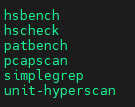
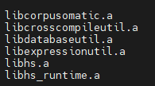

# 安装指南<a name="ZH-CN_TOPIC_0000002520718454"></a>

## 简介<a name="ZH-CN_TOPIC_0000002550305593"></a>

本文基于鲲鹏920系列处理器和openEuler操作系统，提供Hyperscan的安装和编译指导。

Hyperscan是一款高性能的正则表达式匹配库，它是以PCRE（Perl-compatible regular expression）为原型开发，并以BSD（Berkeley Software Distribution）许可证开源，遵循libpcre库通用的正则表达式语法，拥有独立的C语言接口。在Hyperscan正式发布版本的基础上，参考华为鲲鹏微架构特征，重新设计核心接口的实现机制，并完成了开发和性能优化，推出适合鲲鹏计算平台的软件包。使用鲲鹏计算平台的用户可以根据自己业务需求下载本软件包，提升业务在鲲鹏平台上的稳定性和性能。

Hyperscan鲲鹏计算平台软件版本主要增加了以下功能：

- 增加鲲鹏计算平台分支，且完全兼容ARMv8-a，同时确保x86平台使用不受影响。
- 通过使用NEON指令、内联汇编、数据对齐、指令对齐、内存数据预取、静态分支预测、代码结构优化等方法，实现在鲲鹏计算平台的性能提升。
- 发布KHSEL（Kunpeng Hyperscan Enhanced Library）软件增强包，包括短规则旁路混合模型和假阳性阻断模型。
    - KHSEL优化了大规模规则集匹配算法FDR，小规模快速匹配算法Shufti，增强了Hyperscan处理snort_literal，snort_pcre等数据集的scan性能，并且针对长规则校验的场景进行了优化。
    - 提供短规则旁路混合模型，对包含短规则的规则集合能大幅提高匹配性能。
    - 提供假阳性阻断模型，对包含坏字符串片段的规则集合能大幅提高匹配性能。其中的“坏字符串”指少量含特殊片段的规则，其导致多模匹配算法报告的假阳性过多，触发大量的解释器调用和低效的长规则校验，而最终无一真实匹配。大量无谓的解释器调用成为热点，多模匹配失去了应有的预过滤能力。

更多关于Hyperscan的信息，请参考[鲲鹏Gitcode代码仓](https://gitcode.com/boostkit/hyperscan)。

## 环境要求<a name="ZH-CN_TOPIC_0000002550305599"></a>

### 已验证环境<a name="ZH-CN_TOPIC_0000002550345615"></a>

Hyperscan当前适配的处理器鲲鹏920系列处理器，操作系统为openEuler 22.03/openEuler 24.03 LTS SP4。若您在使用过程中遇到问题，请先检查使用的环境是否在已验证的环境范围内。

### 软件要求<a name="ZH-CN_TOPIC_0000002550345611"></a>

安装编译前参见本章节提供的相关链接获取对应的软件包

软件要求如[**表 1** 软件要求](#软件要求)所示。

**表 1** 软件要求<a id="软件要求"></a>

|软件名称|版本|说明|获取方式|
|--|--|--|--|
|GCC|10.3及以上|必选。|-|
|CMake|2.8.11及以上|必选。|-|
|Ragel|6.9及以上|必选：编译依赖Ragel。|[获取链接](http://www.colm.net/files/ragel/ragel-6.10.tar.gz)|
|Boost|1.57及以上|必选：编译依赖Boost头文件。|[获取链接](https://archives.boost.io/release/1.87.0/source/boost_1_87_0.tar.gz)|
|PCRE|8.41及以上|可选：Hyperscan tools正确性验证工具hscollider编译依赖PCRE的8.41及以上版本。|[获取链接](https://sourceforge.net/projects/pcre/files/pcre/8.43/pcre-8.43.tar.gz)|
|SQLite|SQLite 3|可选：Hyperscan tools测试工具hsbench编译依赖SQLite 3。|使用Yum工具安装。|
|Hyperscan|master|必选：待编译软件。|[获取链接](https://gitcode.com/boostkit/hyperscan/tree/master)|

## 配置编译环境<a name="ZH-CN_TOPIC_0000002550305597"></a>

### （可选）配置本地源<a name="ZH-CN_TOPIC_0000002550305595"></a>

正确配置Yum源，以便于后续能够正常安装所需依赖包和软件。

1. 挂载系统镜像，本文以openEuler为例。

    ```bash
    mount YOUR_OS.iso /mnt -o loop
    ```

    > **说明：** 
    >**YOUR\_OS.iso**表示读者当前环境操作系统的镜像文件。

2. 配置Yum本地源。
    1. 创建并打开“/etc/yum.repos.d/openEuler.repo“文件。

        ```bash
        vim /etc/yum.repos.d/openEuler.repo
        ```

        > **说明：** 
        >openEuler.repo文件需要自行创建，建议备份原有repo文件。

    2. 按“i“键进入编辑模式，在openEuler.repo文件中添加如下内容：

        ```bash
        [openEuler]
        name=openEuler
        baseurl=file:///mnt
        enabled=1
        gpgcheck=0
        ```

    3. 按“Esc“键，输入`:wq!`并按“Enter“键保存并退出编辑。

3. 使Yum源配置生效。

    ```bash
    yum clean all
    yum makecache
    ```

### 安装Ragel<a name="ZH-CN_TOPIC_0000002518785772"></a>

由于Hyperscan的编译依赖于Ragel，本文中编译环境采用Ragel 6.10版本。

1. 获取Ragel 6.10源码包。

    ```bash
    wget http://www.colm.net/files/ragel/ragel-6.10.tar.gz
    ```

    > **说明：** 
    >对于服务器无法连接外网的情况，可以将软件包下载到本地再上传到服务器。软件包下载地址请参见[软件要求](#软件要求)。

2. 解压源码包。

    ```bash
    tar -xzf ragel-6.10.tar.gz
    ```

3. 进入Ragel源码目录。

    ```bash
    cd ./ragel-6.10
    ```

4. 编译并安装Ragel。

    ```bash
    ./configure
    make
    make install
    ```

5. 通过检查Ragel版本验证Ragel是否安装成功。

    ```bash
    ragel -v
    ```

    显示“Ragel State Machine Compiler version 6.10 March 2017”则安装成功。

### 配置Boost<a name="ZH-CN_TOPIC_0000002518785768"></a>

编译Hyperscan依赖于1.57及以上版本的Boost，本文编译环境采用的是Boost 1.87版本。提供两种配置Boost的方法，请根据实际情况选择。

- 第一种：下载软件包并建立软链接，使用该方法直接创建Boost软链接即可，不需要执行安装Boost命令。
- 第二种：下载软件包并安装，将Boost软件包安装到服务器中，不需要每次下载源码软链接Boost头文件，该安装步骤不需要建立软链接。

以下是两种配置方法的具体步骤：

**方法一：下载软件包并建立软链接<a name="section194461025186"></a>**

1. 获取Boost 1.87源码包。

    ```bash
    wget https://archives.boost.io/release/1.87.0/source/boost_1_87_0.tar.gz
    ```

2. 解压源码。

    ```bash
    tar -zxf boost_1_87_0.tar.gz
    ```

3. 建立软链接。
    
    ```bash
    ln -s {boost_path}/boost include/boost
    ```

    > **说明：** 
    >编译依赖Boost头文件，{boost\_path}即boost\_1\_87\_0.tar.gz解压后的全路径，此处boost\_path推荐使用绝对路径。

**方法二：下载软件包并安装<a name="section1857344614147"></a>**

1. 获取软件包。

    ```bash
    wget https://archives.boost.io/release/1.87.0/source/boost_1_87_0.tar.gz
    ```

2. 解压软件包。

    ```bash
    tar -zxf boost_1_87_0.tar.gz
    ```

3. 进入解压缩后的目录。

    ```bash
    cd boost_1_87_0
    ```

4. 运行bootstrap.sh脚本并设置相关参数。

    ```bash
    ./bootstrap.sh --with-libraries=all --with-toolset=gcc
    ```

5. 执行编译。

    ```bash
    ./b2 toolset=gcc
    ```

6. 安装Boost。

    ```bash
    ./b2 install --prefix=/usr
    ```

    安装完成后，有类似如下提示则表示安装成功。

    

7. 更新系统的动态链接库。

    ```bash
    ldconfig
    ```

### 下载PCRE<a name="ZH-CN_TOPIC_0000002518625864"></a>

Hyperscan tools工具hscollider的编译依赖PCRE 8.41及以上版本，本文采用PCRE 8.43版本。

1. 请参见[**表 1** 软件要求](#软件要求)获取PCRE 8.43源码。
2. 解压源码。

    ```bash
    tar -zxf pcre-8.43.tar.gz
    ```

### 安装SQLite<a name="ZH-CN_TOPIC_0000002518785774"></a>

Hyperscan tools工具hsbench编译依赖SQLite 3，使用Yum命令安装SQLite及SQLite开发套件，安装完成后进行版本验证。

1. 安装SQLite及开发套件。

    ```bash
    yum install sqlite sqlite-devel
    ```

2. 安装完成后使用以下命令验证开发套件是否配置成功。

    ```bash
    pkg-config --libs sqlite3
    ```

    - 如果执行成功，则回显内容如下所示。

        ```bash
        -lsqlite3
        ```

    - 如果执行失败，则需要按以下步骤操作。
        1. 打开“/usr/lib64/pkgconfig/sqlite3.pc“文件。

            ```bash
            vim /usr/lib64/pkgconfig/sqlite3.pc
            ```

        2. 按“i“键进入编辑模式，在“/usr/lib64/pkgconfig/sqlite3.pc“文件中添加如下内容。

            ```bash
            # Package Information for pkg-config
            
            prefix=/usr
            exec_prefix=/usr
            libdir=/usr/lib64
            includedir=/usr/include
            
            Name: SQLite
            Description: SQL database engine
            Version: 3.37.2
            Libs: -L${libdir} -lsqlite3
            Libs.private: -lm -lz
            Cflags: -I${includedir}
            ```

            > **说明：** 
            >其中libdir、includedir等以实际安装路径进行设置。

        3. 按“Esc“键，输入`:wq!`并按“Enter“键保存并退出编辑。

### 安装KHSEL<a name="ZH-CN_TOPIC_0000002550345613"></a>

KHSEL是Hyperscan增强软件包，可以提升Hyperscan的scan性能。目前gitcode平台dev分支已集成KHSEL源码，位于`src\kunpeng-enhanced`目录下，不再需要单独安装KHSEL相关软件包。

## 编译Hyperscan<a name="ZH-CN_TOPIC_0000002518625866"></a>

在Hyperscan源码目录下添加PCRE依赖库，最后进行源码静态库、动态库或Debug模式的编译。

1. 进入Hyperscan源码目录。

    ```bash
    cd hyperscan
    ```

2. 添加PCRE依赖库。

    源码hscollider工具编译依赖于PCRE工具。

    1. 切换到pcre-8.43下载目录，将解压后的pcre-8.43文件夹拷贝到Hyperscan源码目录下并重命名为pcre文件夹。

        ```bash
        cp -rf ./pcre-8.43 hyperscan/pcre
        ```

    2. 打开“pcre/CMakeLists.txt“文件。

        ```bash
        vim hyperscan/pcre/CMakeLists.txt
        ```

    3. 按“i“键进入编辑模式，将拷贝后的“pcre/CMakeLists.txt“文件中第77行注释掉，如下所示。

        ```bash
        CMAKE_MINIMUM_REQUIRED(VERSION 2.8.0)
        #CMAKE_POLICY(SET CMP0026 OLD)
        ```

        CMakeLists.txt文件中第77行命令在低于2.8.1的版本下无法识别且不影响功能，故需要将其注释掉。也可以通过升级系统CMake版本为3.0及以上解决上述**CMAKE\_POLICY**命令无法识别问题。

    4. 按“Esc“键，输入`:wq!`并按“Enter“键保存并退出编辑。

3. 编译源码。
    1. 进入Hyperscan源码目录。

        ```bash
        cd hyperscan
        ```

    2. 创建“build“目录。

        ```bash
        mkdir -p build
        ```

    3. 进入创建好的“build“目录。

        ```bash
        cd build
        ```

    4. 执行编译。

        编译支持release模式和debug模式，编译后会生成静态库和动态库。默认使用release模式并生成静态库，若需生成动态库，则需添加相应编译选项。

        - 编译源码静态库。编译选项默认为release模式编译静态库。

            ```bash
            cmake ..
            make -j
            ```

            编译完成后，默认生成Hyperscan的静态库和测试程序：

            

            编译完成生成的测试程序：

            

            生成的静态库：

            

        - 编译源码动态库。在执行编译命令中增加生成动态库编译选项：-DBUILD\_SHARED\_LIBS=ON。

            ```bash
            cmake .. -DBUILD_SHARED_LIBS=ON
            ```

            生成的动态库：

            

        - 在鲲鹏计算平台编译源码debug模式。在执行编译命令中增加生成动态库编译选项：-DCMAKE\_BUILD\_TYPE=DEBUG。

            ```bash
            cmake .. -DCMAKE_BUILD_TYPE=DEBUG
            ```

        - 在x86计算平台编译源码debug模式。在执行编译命令中增加生成动态库编译选项：-DCMAKE\_BUILD\_TYPE=DEBUG。

            ```bash
            cmake .. -DCMAKE_BUILD_TYPE=DEBUG -DCMAKE_C_FLAGS="-D__X86_64__" -DCMAKE_CXX_FLAGS="-D__X86_64__"
            ```
