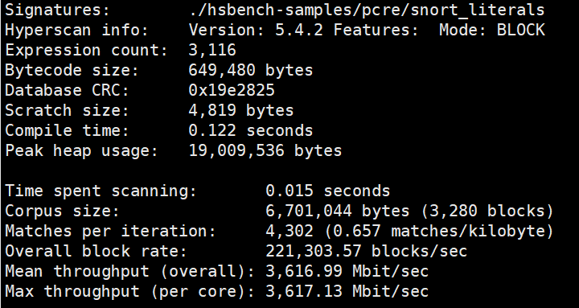

# 快速入门<a name="ZH-CN_TOPIC_0000002550013877"></a>

## hsbench通用字节码性能测试
hsbench是Hyperscan官方提供的性能Benchmark工具，通过hsbench的测试结果能够对比使用KHSEL库前后的性能差异。

1. 进入创建好的`build`目录。

    ```bash
    cd build
    ```

2. 获取[hsbench规则集](https://cdrdv2.intel.com/v1/dl/getContent/739375)并输入数据，并解压到`build/hsbench-samples`目录。
3. 运行hsbench。

不使用通用字节码：
    ```bash
    ./bin/hsbench -e ./hsbench-samples/pcre/snort_literals -c ./hsbench-samples/corpora/gutenberg.db -N -n1
    ```
使用通用字节码：
    ```bash
    ./bin/hsbench -U ./dump/db.raw -c ./hsbench-samples/corpora/gutenberg.db -N -n1
    ```

    运行结果：

    

    运行结果参数说明如下：

    - Time spent scanning：使用目标规则集扫描目标数据库，扫描所用的时间。
    - Matches per iteration：每次迭代，按规则集匹配命中的数量。
    - Mean throughput \(overall\)：平均吞吐量（Mbit每秒）。
    - Max throughput \(per core\)：所有CPU核中的最大吞吐量（Mbit每秒）。

## hsdump通用字节码生成工具

hsdump是Hyperscan提供的调试工具，用于转储模式编译过程中的内部信息。通用字节码功能支持同时生成可在x86和鲲鹏计算平台部署的双架构规则集编译后字节码，
1. 进入创建好的`build_debug`目录。

    ```bash
    cd build_debug
    ```

2. 准备规则文件。创建一个包含正则表达式的文件，例如`patterns.txt`，格式如下：

    ```
    1:/hatstand.*teakettle/s
    2:/(hatstand|teakettle)/iH
    ```

3. 运行hsdump，生成通用字节码调试信息。

    ```bash
    ./bin/hsdump -e patterns.txt -o ./dump_output -U -X
    ```

    参数说明：

    - `-e PATH`：指定规则文件路径。
    - `-o PATH`：指定输出目录（默认为当前目录）。
    - `-U, --dump_db`：转储最终数据库（通用字节码格式）。
    - `-N, --block`：使用块模式编译（默认为流模式）。
    - `-V, --vectored`：使用向量化模式编译。
    - `-X, --no_intermediate`：不转储中间数据。

4. 查看输出结果。
    hsdump会在指定输出目录中生成通用字节码文件：`db.raw`。

5. 使用场景。
    将db.raw跨平台部署。

6. 注意事项。
    - hsdump需要在Debug模式下编译Hyperscan才能使用。
