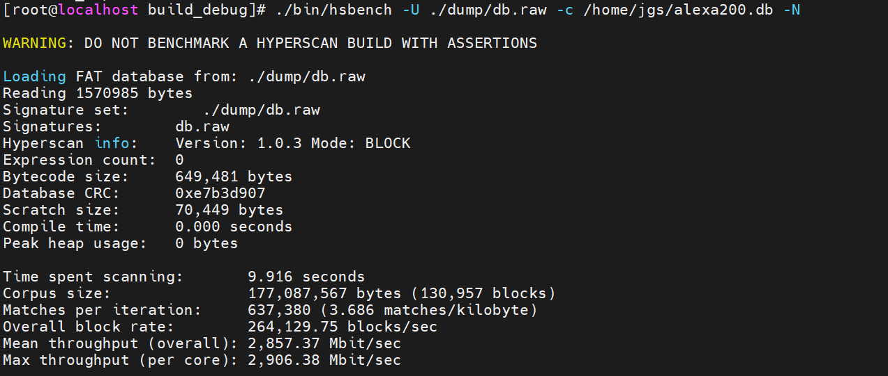

# 快速入门

## 前提条件

请参考[安装指南](./installation_guide.md)完成Ultrascan的安装和编译。

## hsdump通用字节码生成工具

对于需要编译一套规则集字节码，将该字节码同时部署到鲲鹏计算平台和x86计算平台上的场景，使用hsdump进行字节码的编译并生成编译后文件（下文称通用字节码）。hsdump是Ultrascan提供的调试工具，用于转储模式编译过程中的内部信息。通过hsdump可以编译出支持跨平台部署的字节码。

1. 准备规则文件。在`/opt/Ultrascan/build-debug/patterns.txt`中写入正则表达式，格式如下：

    ```text
    1:/hatstand.*teakettle/s
    2:/(hatstand|teakettle)/iH
    ```

2. 运行hsdump，生成通用字节码调试信息。

    ```bash
    cd /opt/Ultrascan/build-debug
    ./bin/hsdump -e ./patterns.txt -o ./dump_output -U -X -N
    ```

    参数说明：

    - `-e PATH`：指定规则文件路径。
    - `-o PATH`：指定输出目录（默认为当前目录）。
    - `-U, --dump_db`：转储最终数据库（通用字节码格式）。
    - `-N, --block`：使用块模式编译（默认为流模式）。
    - `-X, --no_intermediate`：不转储中间数据。
    - `-G OVERRIDES`：在本次进程中设置Grey编译参数，例如`-G "allowLily:1;"`。

3. 查看输出结果。

    hsdump会生成通用字节码文件`/opt/Ultrascan/build-debug/dump_output/db.raw`。

## hsbench通用字节码性能测试

hsbench是Ultrascan提供的Benchmark性能测试工具，可用于观察指定规则集和语料上的匹配吞吐、命中数和数据库资源开销。

1. 获取[hsbench规则集](https://cdrdv2.intel.com/v1/dl/getContent/739375)，并解压到`/opt/Ultrascan/hsbench-samples`目录。该目录由用户准备，不属于Ultrascan构建产物。

2. 运行hsbench。

    不使用通用字节码：

    ```bash
    cd /opt/Ultrascan/build
    ./bin/hsbench \
        -e ../hsbench-samples/pcre/snort_literals \
        -c ../hsbench-samples/corpora/gutenberg.db -N -n 1
    ```

    使用通用字节码：

    ```bash
    ./bin/hsbench \
        -U /opt/Ultrascan/build-debug/dump_output/db.raw \
        -c ../hsbench-samples/corpora/gutenberg.db \
        -N -n 1
    ```
        
    参数说明：

    - `-e PATH`：指定规则文件路径。
    - `-U, --dump_db`：使用通用字节码格式数据库。
    - `-c, --corpus`：指定测试数据库路径。
    - `-N, --block`：使用块模式编译（默认为流模式）。
    - `-n, --num_iterations`：指定测试迭代次数（默认为1）。
    - `-G OVERRIDES`：编译规则时设置Grey参数；加载已生成的数据库时应保证其编译配置符合预期。

    运行结果（使用规则集）：

    

    运行结果（使用通用字节码）：
    

    运行结果参数说明如下：

    - Time spent scanning：使用目标规则集扫描目标数据库，扫描所用的时间。
    - Matches per iteration：每次迭代，按规则集匹配命中的数量。
    - Mean throughput \(overall\)：平均吞吐量（Mbit每秒）。
    - Max throughput \(per core\)：所有CPU核中的最大吞吐量（Mbit每秒）。

## hspgo正则匹配反馈优化技术工具

`hspgo`用于演示和评估正则匹配反馈优化技术的完整闭环：编译baseline数据库、采集语料、筛选反馈、重新编译数据库，并在新数据库生效后测量吞吐。

### 前提条件

- 在AArch64平台以`-DHS_ENABLE_FP_FEEDBACK=ON`构建Ultrascan。
- 构建环境已安装SQLite 3，否则不会生成`hspgo`。
- 准备hsbench格式的规则文件或目录，以及SQLite语料库。

具体构建命令见[安装指南](./installation_guide.md)中的“编译Ultrascan”步骤。

### 采集并反馈编译

以下命令使用块模式并显式指定 `-b 1 -n 5`（两者默认值均为20，与hsbench `-n` 默认值一致），先运行1轮普通baseline对照，随后执行工具内置的反馈采集，并在切换到反馈编译数据库后测量5轮。示例把筛选阈值降低到1，便于在小语料上观察流程；生产环境应先使用默认阈值，再根据dump结果调优。

```bash
cd /opt/Ultrascan/build-feedback
./bin/hspgo \
    -e /opt/Ultrascan/hsbench-samples/pcre/teakettle_2500 \
    -c /opt/Ultrascan/hsbench-samples/corpora/gutenberg.db \
    -N -b 1 -n 5 \
    -m 1 -p 1 -q 0 -s 0 -k 3 \
    -o ./hspgo-output \
    -O ./hspgo-feedback \
    -G "allowLily:1;allowNeoFdr:0"
```

主要参数：

| 参数 | 说明 |
| --- | --- |
| `-e PATH` | 规则文件或目录。 |
| `-c FILE` | hsbench SQLite语料库。 |
| `-N`/`-V` | 分别选择block/vectored模式；不指定时使用streaming模式。 |
| `-b N` | baseline普通扫描轮数，默认20（与hsbench `-n` 默认值一致）。 |
| `-n N` | 切换到反馈编译数据库后的测量轮数，默认20（与hsbench `-n` 默认值一致）。 |
| `-m N` | 最小trigger数，默认1000。 |
| `-p N` | 最小false-positive trigger数，默认1000。 |
| `-q RATIO` | 最小false-positive比例，范围0~1，默认0.99。 |
| `-s RATIO` | 最小全局浪费占比，范围0~1，默认0.05。 |
| `-k N` | 最多保留的坏fragment数；默认不限制。 |
| `-v` | 输出汇总、诊断及排名靠前的fragment。 |
| `-o DIR` | 输出report和feedback CSV。 |
| `-O DIR` | 输出可复用的feedback二进制文件。 |
| `-G OVERRIDES` | 设置本轮baseline和反馈编译共用的Grey参数；`allowNeoFdr` 传非零值会被强制置0并输出warning。 |

工具只统计反馈数据库切换完成后的优化吞吐；baseline轮数不会混入优化测量结果。如下示例执行。

```text
[root@localhost build-feedback]# ./bin/hspgo \
    -e /opt/Ultrascan/hsbench-samples/pcre/teakettle_2500 \
    -c /opt/Ultrascan/hsbench-samples/corpora/gutenberg.db \
    -N -b 1 -n 5 \
    -m 1 -p 1 -q 0 -s 0 -k 3 \
    -o ./hspgo-output \
    -O ./hspgo-feedback \
    -G "allowLily:1;allowNeoFdr:0"
hspgo feedback demo

HSPGO feedback configuration:
Scan mode:                  block
Threads:                    1
Baseline rounds:            1
Measurement rounds:         5
Source fingerprint:         0xb0834f6dac8a4b93
Feedback source:            collector
Feedback thresholds:        trigger>=1; false>=1; fp_rate>=0; fp_share>=0; topk=3
CSV output dir:             ./hspgo-output
Feedback output dir:        ./hspgo-feedback
Grey overrides:             allowLily:1;allowNeoFdr:0

Baseline database:
Signatures:                 /opt/Ultrascan/hsbench-samples/pcre/teakettle_2500
Ultrascan info:             Version: 5.8.0 Mode: BLOCK
Expression count:           2,500
Bytecode size:              3,256,880 bytes
Database CRC:               0x5f920441
Scratch size:               387,084 bytes
Compile time:               1.304 seconds
Peak heap usage:            35,565,568 bytes

Baseline scan:
Time spent scanning:        0.017 seconds
Corpus size:                6,701,044 bytes (3,280 blocks)
Matches per iteration:      3,771 (0.576 matches/kilobyte)
Overall block rate:         189,390.77 blocks/sec
Mean throughput (overall):  3,095.40 Mbit/sec
Max throughput (per core):  3,130.23 Mbit/sec

Feedback database:
Signatures:                 /opt/Ultrascan/hsbench-samples/pcre/teakettle_2500
Ultrascan info:             Version: 5.8.0 Mode: BLOCK
Expression count:           2,500
Bytecode size:              3,269,424 bytes
Database CRC:               0xca27a5d9
Scratch size:               387,807 bytes
Compile time:               1.376 seconds
Peak heap usage:            42,967,040 bytes

Hot switch: active database replaced by feedback-compiled DB.

Optimized measurement:
Time spent scanning:        0.082 seconds
Corpus size:                6,701,044 bytes (3,280 blocks)
Matches per iteration:      3,771 (0.576 matches/kilobyte)
Overall block rate:         201,131.02 blocks/sec
Mean throughput (overall):  3,287.29 Mbit/sec
Max throughput (per core):  3,291.47 Mbit/sec
Optimized/Baseline:         106.20%
```

### 复用feedback

使用`-I`导入先前由同版本`hspgo`导出的feedback，并跳过重新采集：

```bash
cd /opt/Ultrascan/build-feedback
./bin/hspgo \
    -e /opt/Ultrascan/hsbench-samples/pcre/snort_literals \
    -c /opt/Ultrascan/hsbench-samples/corpora/gutenberg.db \
    -N -I ./hspgo-feedback -n 5
```

导入时，扫描模式、规则集和Grey覆盖字符串必须与导出时一致。`hspgo`会校验工具层fingerprint；公开`hs_fp_feedback_t`本身不携带此指纹，因此业务直接集成API时必须自行保证配置一致。

需要把闭环集成到应用时，请参考[正则匹配反馈优化技术API](./api_reference.md#4-正则匹配反馈优化技术api)。
